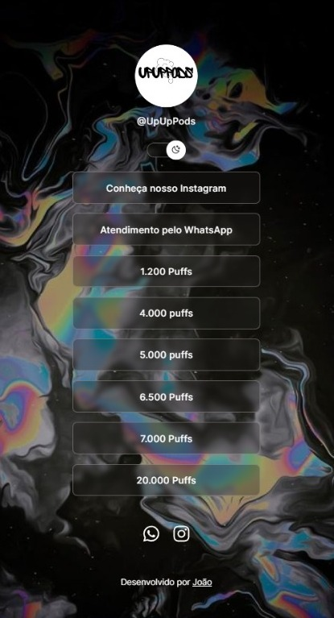

<h1 align="center"> UpUpPods </h1>

Programa criado para a loja UpUpPods

  <a href="#-tecnologias">Tecnologias</a>&nbsp;&nbsp;&nbsp;|&nbsp;&nbsp;&nbsp;
  <a href="#-projeto">Projeto</a>&nbsp;&nbsp;&nbsp;|&nbsp;&nbsp;&nbsp;
  <a href="#-layout">Layout</a>&nbsp;&nbsp;&nbsp;|&nbsp;&nbsp;&nbsp;
  <a href="#memo-licença">Licença</a>

  

 

  

## 🚀 Tecnologias

Esse projeto foi desenvolvido com as seguintes tecnologias:

- HTML e CSS
- JavaScript
- Git e Github

## 💻 Projeto

O programa é um agregador de links para a loja.

## 🔖 Layout

## :memo: Licença

Esse projeto está sob a licença MIT.

---

Desenvolvido por João :wave: (https://instagram.com/victorjoao1280?utm_source=qr&igshid=MzNlNGNkZWQ4Mg%3D%3D)